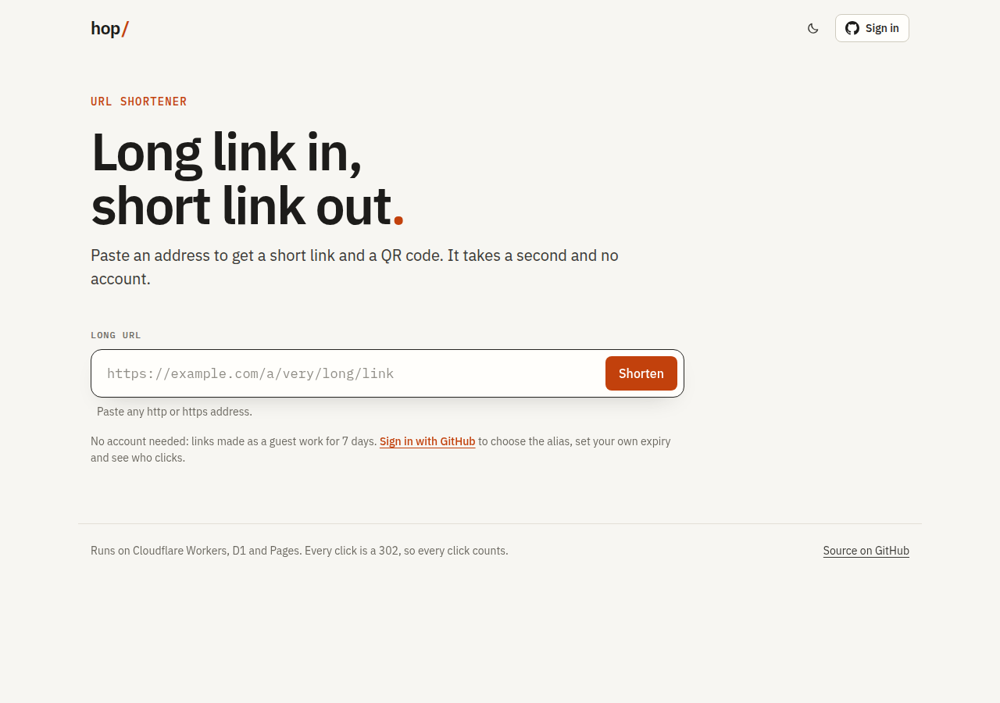
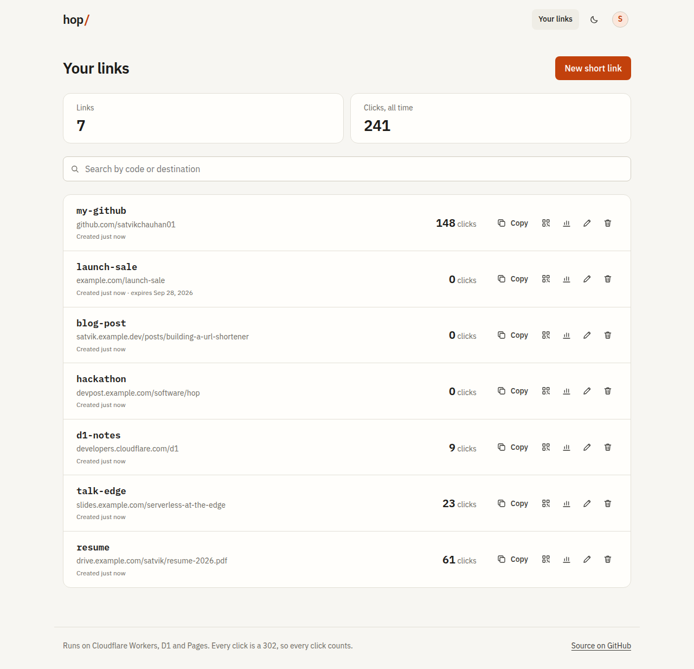
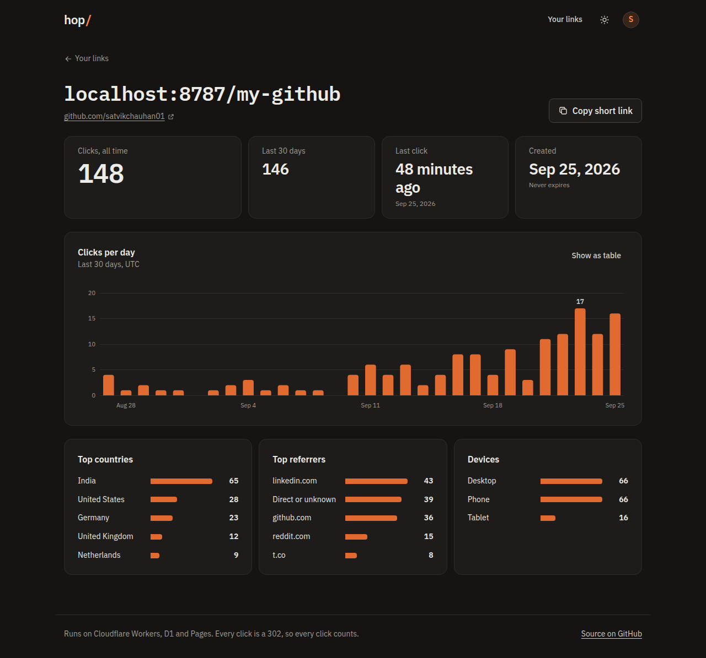
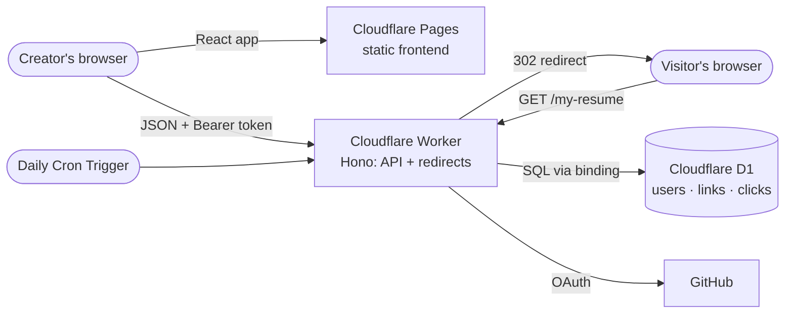

# hop/ — a serverless URL shortener

Paste a long URL, get a short link and a QR code. Sign in with GitHub to pick your own
alias, set an expiry, and see who clicks: per day, per country, per referrer and per
device.

Everything runs on Cloudflare's serverless platform. There is no server to look after:
a **Worker** answers the API and the redirects at the edge, **D1** (SQLite) stores the
data, and the React frontend is a static site on **Cloudflare Pages**. GitHub Actions
tests every push and deploys `main`.

> **Live:** [hop-frontend.pages.dev](https://hop-frontend.pages.dev) · API and short links on
> [url-shortener.satvik-url-shortener.workers.dev](https://url-shortener.satvik-url-shortener.workers.dev)
> · [Roadmap](ROADMAP.md) · [Requirements](REQUIREMENTS.md)



| Your links                                   | One link's clicks (dark theme)                 |
| -------------------------------------------- | ---------------------------------------------- |
|  |  |

## Features

- **Short links for anyone.** No account needed; guest links get a random 7-character
  code and last 7 days.
- **Custom aliases** such as `/my-resume`, checked for availability while you type.
- **Expiry dates.** Expired links show a clear "this link has expired" page (410).
- **Click analytics.** Clicks per day for the last 30 days, top countries, referrers and
  devices. Link previews from Slack, WhatsApp and friends, crawlers and scripts are not
  counted. No IP addresses are stored.
- **QR codes** for every link, downloadable as PNG or SVG.
- **Dashboard:** search, edit the destination or expiry, delete with a 5-second undo.
- **Rate limiting** on link creation, alias checks and sign-in.
- **Light and dark themes**, keyboard support throughout, and layouts that work from a
  360 px phone up. On the production build, Lighthouse scores 100 in every category on
  desktop.

## Architecture



There are two separate paths through the system:

- **Creating a link** goes through the React app, which calls the Worker's API.
- **Following a link** never touches the React app. The browser hits the Worker, which
  looks the code up in D1 (one indexed read), answers with a `302`, and records the click
  in the background with `ctx.waitUntil()`, so the visitor never waits on analytics.

## Stack

| Part     | Choice                                                                 |
| -------- | ---------------------------------------------------------------------- |
| API      | Cloudflare Workers, [Hono](https://hono.dev), JavaScript (ES modules)  |
| Database | Cloudflare D1, schema in numbered SQL migrations                       |
| Frontend | React 19, React Router, Vite, hand-written CSS Modules, IBM Plex fonts |
| Auth     | GitHub OAuth, stateless HS256 JWT                                      |
| Abuse    | Workers Rate Limiting binding                                          |
| Tests    | Vitest inside the Workers runtime, Vitest + Testing Library for the UI |
| Delivery | GitHub Actions and `cloudflare/wrangler-action`                        |

## API

All responses are JSON. Errors look like `{ "error": { "code": "alias_taken", "message": "…" } }`.

| Method | Path                      | Who       | What it does                                                                    |
| ------ | ------------------------- | --------- | ------------------------------------------------------------------------------- |
| GET    | `/:code`                  | anyone    | `302` to the destination; `404` / `410` pages otherwise                         |
| POST   | `/api/links`              | anyone    | Create a link: `{ url, alias?, expiresAt? }` (alias and expiry need an account) |
| GET    | `/api/links/availability` | anyone    | `?alias=` → `{ alias, available, reason }`                                      |
| GET    | `/api/links`              | signed in | Your links, newest first; `?q=` searches, `?cursor=` pages                      |
| GET    | `/api/links/:code/stats`  | owner     | Totals, daily series, top countries, referrers, devices                         |
| PATCH  | `/api/links/:code`        | owner     | Change `url` and/or `expiresAt` (`null` removes the expiry)                     |
| DELETE | `/api/links/:code`        | owner     | Delete the link and its clicks                                                  |
| GET    | `/api/me`                 | signed in | Profile plus link and click totals                                              |
| GET    | `/api/auth/github`        | anyone    | Start GitHub sign-in                                                            |
| GET    | `/api/health`             | anyone    | `200` when D1 answers, `503` when it doesn't                                    |

## Running it locally

You need Node.js 22 or newer. No Cloudflare account is needed: Wrangler runs the Worker
and a local D1 database on your machine.

```bash
# The API and redirects, on http://localhost:8787
cd worker
npm install
cp .dev.vars.example .dev.vars   # then fill it in, see below
npm run db:migrate
npm run dev

# The frontend, on http://localhost:5173 (in a second terminal)
cd frontend
npm install
npm run dev
```

`worker/.dev.vars` needs a `JWT_SECRET` (any long random string) and the client id and
secret of a GitHub OAuth app whose callback URL is
`http://localhost:8787/api/auth/github/callback`. Guest links work without them.

Visits from `curl` count as automated traffic, so they redirect but are not counted.
Open a short link in a browser to see a click land. The daily cleanup can be run on
demand with `npx wrangler dev --test-scheduled` and a visit to
`http://localhost:8787/__scheduled?cron=17+3+*+*+*`.

## Tests

```bash
cd worker && npm test     # 171 tests inside the Workers runtime, each on a fresh D1
cd frontend && npm test   # 36 tests with Testing Library
npm run lint && npm run format:check   # in either package
```

The Worker tests cover every endpoint and error, the redirect (including that it answers
before the click is written), bot filtering, rate limits, the OAuth flow with GitHub
mocked, ownership rules, and a check that no query ever scans a whole table.

## Deploying

One-time setup, from the `worker/` folder, signed in with `npx wrangler login`:

1. `npx wrangler d1 create url-shortener`, then put the printed `database_id` into
   `worker/wrangler.jsonc`.
2. `npx wrangler pages project create <pages-project> --production-branch main`.
3. Create a GitHub OAuth app for production with the callback URL
   `https://<worker-host>/api/auth/github/callback`, then store three secrets:
   `npx wrangler secret put JWT_SECRET`, `… GITHUB_CLIENT_ID`, `… GITHUB_CLIENT_SECRET`.
4. In the GitHub repository settings, add the secrets `CLOUDFLARE_API_TOKEN` (a token
   allowed to edit Workers, D1 and Pages) and `CLOUDFLARE_ACCOUNT_ID`, and the variables
   `API_URL` (the Worker's URL), `FRONTEND_URL` (the Pages URL) and `PAGES_PROJECT`.

After that, every push to `main` runs the checks, applies new migrations, deploys the
Worker and deploys the frontend (`.github/workflows/ci-cd.yml`).

## Design decisions

- **302, never 301.** Browsers cache 301s, so repeat visits would skip the Worker: those
  clicks would go uncounted, and expiring or editing a link would not reach people who
  had already visited.
- **Analytics after the response.** The click is written with `ctx.waitUntil()` in one
  D1 batch (the click row plus the counter), so redirects stay fast and the counter can
  never drift from the rows.
- **Watching D1's free limits.** Since September 2026, D1's free plan stops serving
  every query for the rest of the day once 100,000 rows are written or 5 million read.
  A click costs about three row writes, which puts the ceiling near 33,000 clicks a day;
  indexes keep reads to what a query needs, and a test fails if any query scans a table.
- **Stateless sessions.** A signed JWT in the `Authorization` header, because the
  frontend and the API live on different sites, where cookies are unreliable. The token
  reaches the app in the URL fragment, which browsers never send to a server, and is
  wiped from the address bar straight away. Signing out is local; tokens expire after 7
  days.
- **Approximate rate limits.** The Workers Rate Limiting binding counts per Cloudflare
  location. That is enough to slow abuse down, and it costs nothing extra.
- **Guest mode.** Visitors can try the product without an account, but guest links
  expire after a week and are rate-limited per IP, which keeps abuse cheap to contain.

## Repository layout

```
worker/      Cloudflare Worker: routes, middleware, SQL, helpers, HTML status pages, jobs
frontend/    React app: api client, components, pages, hooks, helpers, styles
docs/        screenshots used in this README
.github/     CI/CD workflow
```
